# Task Manager
<p> 
A Task Manager application is a productivity tool that helps users manage, track, and organize their tasks efficiently. Users can take control of their to-do lists and focus on achieving their goals with greater efficiency and clarity. It enables users to streamline their workflow by categorizing tasks based on their status, such as New, In Progress, Completed, or Cancelled.
</p>

## Installation
### Clone the repository
```
git clone "https://github.com/priyankatuli/task_manager.git"
```
### Install dependencies
```
   Flutter pub get
```
### Flutter Version Management
```
 fvm use
```
### Build Apk
```
   flutter build apk --release
```
## Tech Stack
- Flutter
- Dart
- Rest API

### 📸 Screenshots
`1. Login & Sign Up Screen`
> Sign Up & Login with JWT authentication for secure data access. OTP based verification to ensure password reset security.
<table>
  <tr>
    <td align="center">
      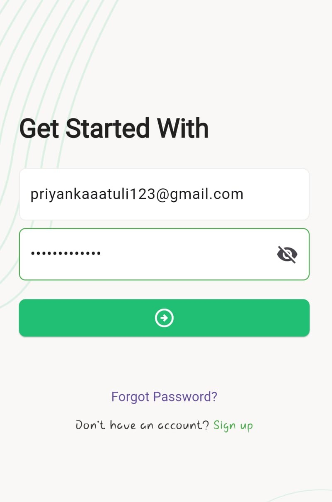<br/>
      Login
    </td>
    <td align="center">
      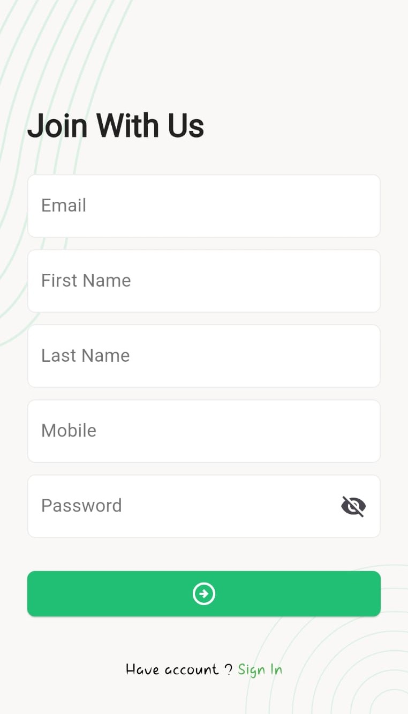<br/>
      Sign Up
    </td>
  </tr>
</table>

`2. Forget Password Screen`
<table>
<tr>
    <td align="center" title="">
      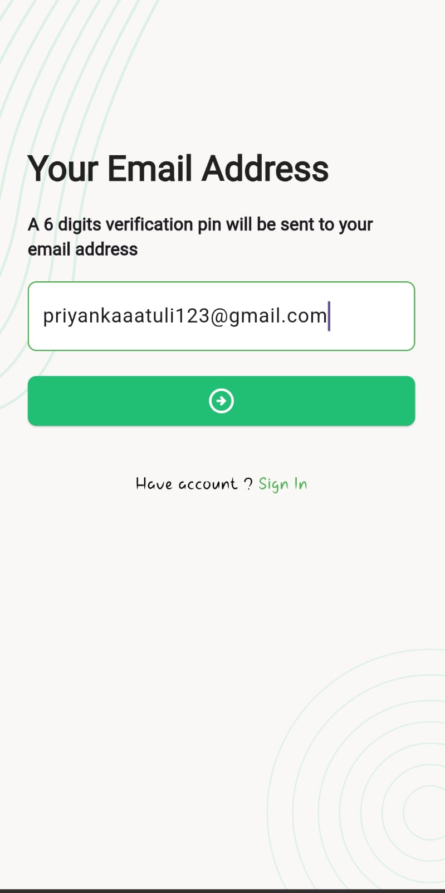<br/>
      Forget Password
    </td>
    <td align="center">
      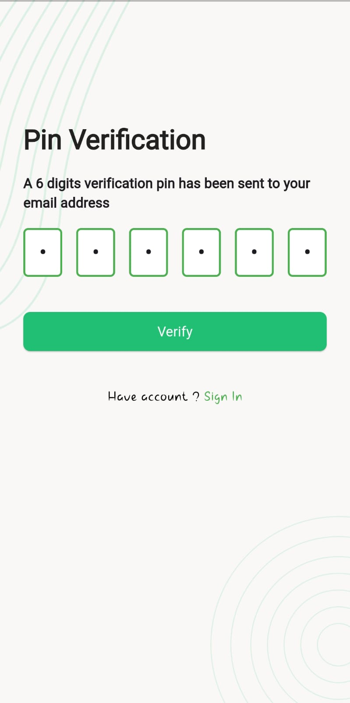<br/>
      OTP
    </td>
    <td align="center">
      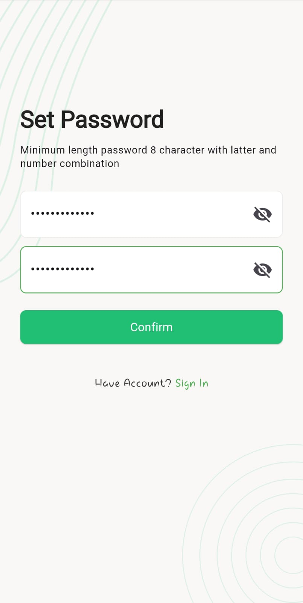<br/>
      Reset Password
    </td>
  </tr>
</table>

`3. Update Profile Screen & Add New Task Screen`
<table>
<tr>
    <td align="center">
      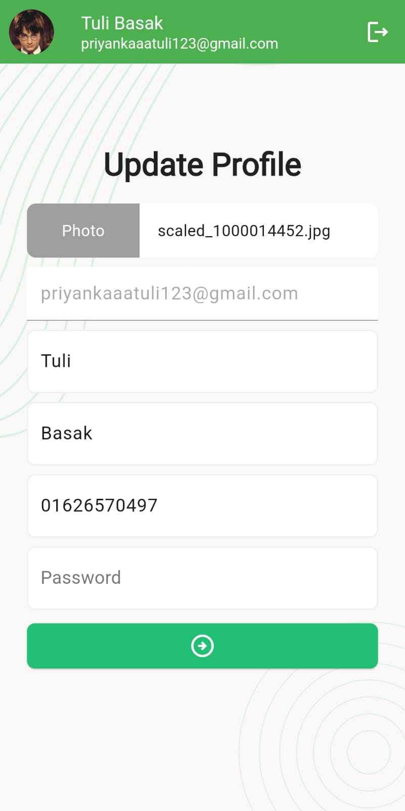<br/>
      Update Profile
    </td>
 <td align="center">
      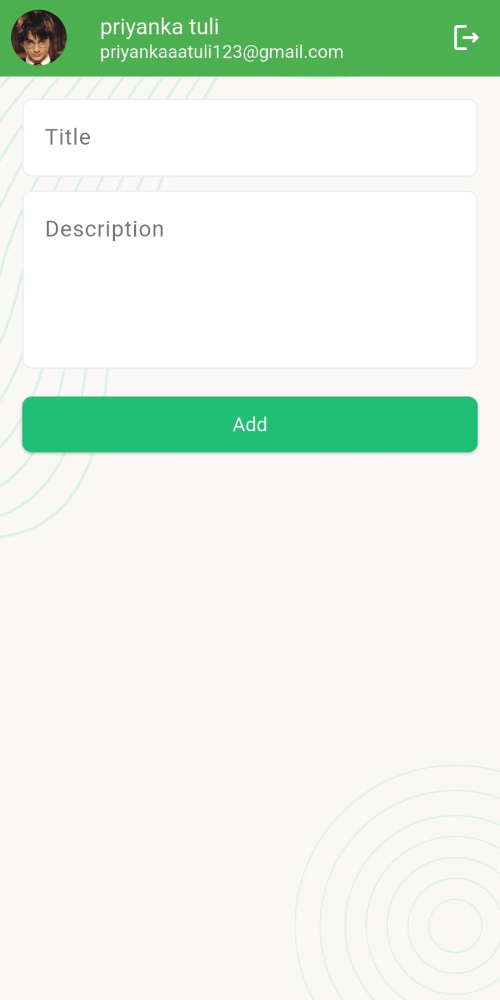<br/>
      Add New Task
    </td>
  </tr>
</table>

`4. Task Management`
<table>
<tr>
    <td align="center">
      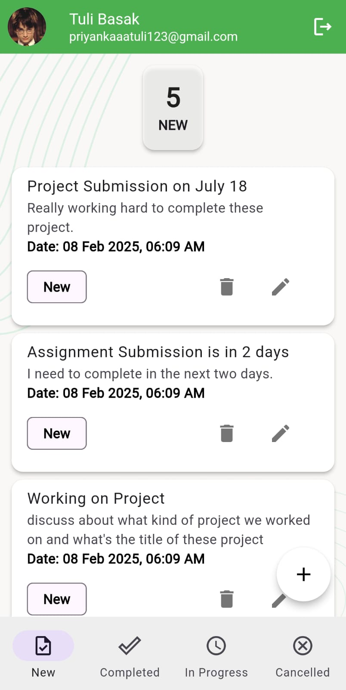<br/>
         New Task 
    </td>
 <td align="center">
      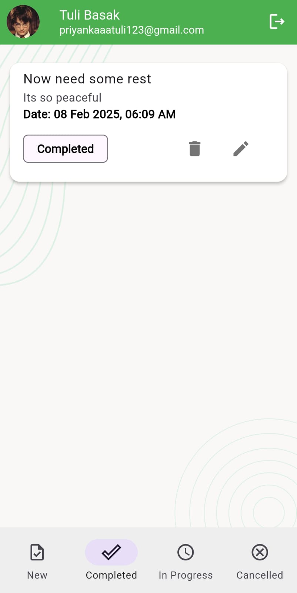<br/>
       Completed Task
    </td>
 <td align="center">
      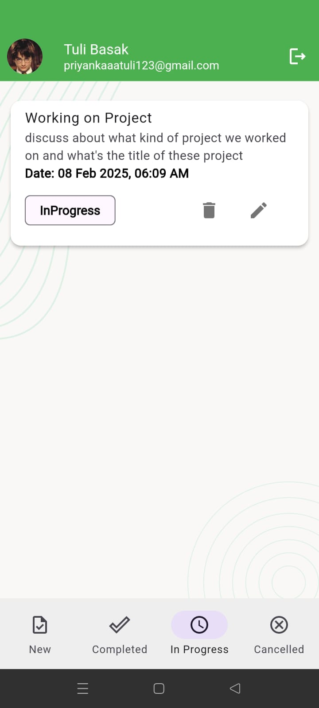<br/>
     In Progress Task
    </td>
 <td align="center">
      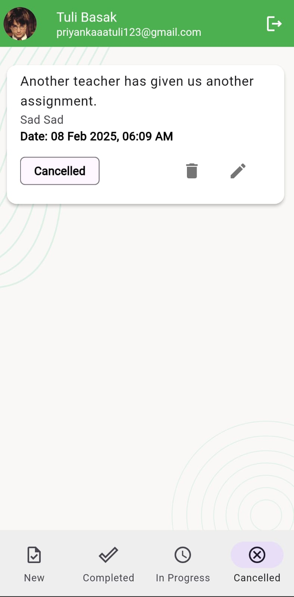<br/>
          Cancelled Task
      </td>
  </tr>
</table>