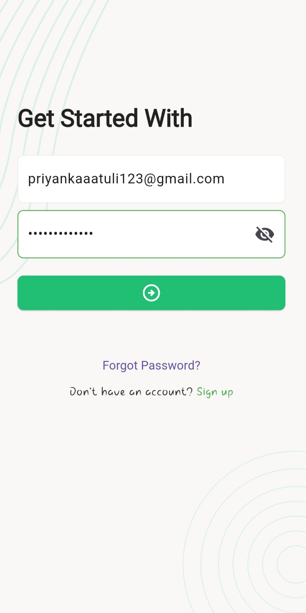
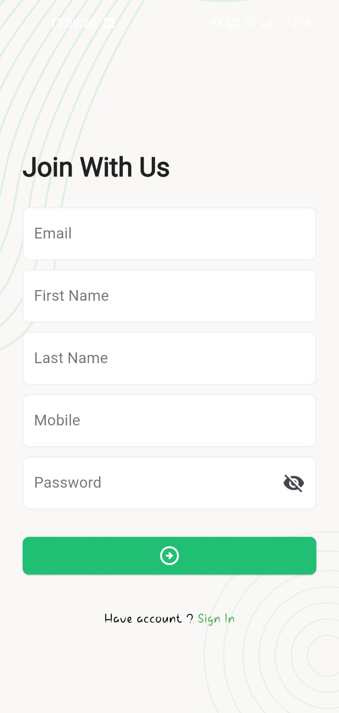

# Task Manager
<p> 
A Task Manager application is a productivity tool that helps users manage, track, and organize their tasks efficiently. Users can take control of their to-do lists and focus on achieving their goals with greater efficiency and clarity. It enables users to streamline their workflow by categorizing tasks based on their status, such as New, In Progress, Completed, or Cancelled.
</p>

## Installation
### Clone the repository
```
git clone "https://github.com/priyankatuli/task_manager.git"
```
### Install dependencies
```
   Flutter pub get
```
### Flutter Version Management
```
 fvm use
```
### Build Apk
```
   flutter build apk --release
```
## Tech Stack
- Flutter
- Dart
- Rest API

### 📸 Screenshots
`1. Splash Screen & Authentication`
> Sign Up & Login with JWT authentication for secure data access. OTP based verification to ensure password reset security.

| Splash Screen and Authentication Screen                                                                                            |                             
|------------------------------------------------------------------------------------------------------------------------------------|
|       | 

`2. Forget Password & Reset Password Screen`
| Forget Password and Reset Password Screen                                                                                            |                             
|------------------------------------------------------------------------------------------------------------------------------------|
|       | 
